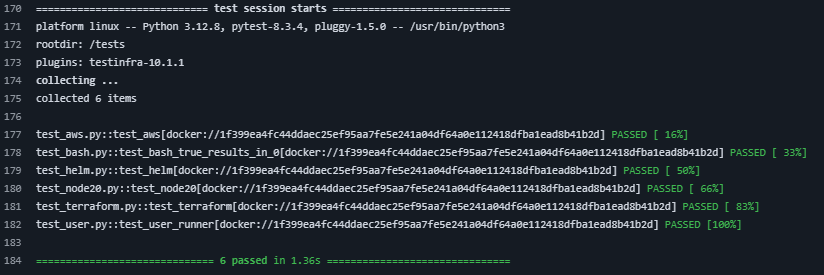

# TestInfra

GitHub Action running your [`TestInfra`](https://testinfra.readthedocs.io/en/latest/) tests



## Options (inputs)

This action supports the following option.

### image

The Docker image to test

* *Required*: `Yes`
* *Type*: `string`
* *Example*: `ghcr.io/wyrihaximusnet/php:8.4-zts-alpine-slim`

### testsPath

The path that contains the Infra tests.

* *Required*: `No`
* *Type*: `string`
* *Example*: `tests`
* *Default*: `test`

### cmd

Command to run on container start.

* *Required*: `No`
* *Type*: `string`
* *Example*: `sleep 600`

### flags

Additional flags to pass to docker run aside `--rm`, `-t`, and `-d`.

* *Required*: `No`
* *Type*: `string`
* *Example*: `--platform="linux/arm64"`

### testSuite

Specify a specific test suite to run.

* *Required*: `No`
* *Type*: `string`
* *Example*: `yes`

## Example

The following example is a slimmed down version of [the workflow that builds my self hosted GitHub Action Runner image](https://github.com/WyriHaximusNet/docker-github-action-runner/blob/33bc83dba052404622b846946084e40b19bb4821/.github/workflows/main.yml).
It shows the full 

```yaml
name: Continuous Integration
env:
  DOCKER_IMAGE: wyrihaximusnet/github-action-runner
on:
  push:
    branches:
      - 'main'
jobs:
  supported-platform-matrix:
    name: Supported processor platforms
    runs-on: ubuntu-latest
    outputs:
      platform: ${{ steps.supported-platform-matrix.outputs.platform }}
    steps:
      - id: supported-platform-matrix
        name: Generate platform
        uses: WyriHaximus/github-action-oci-image-supported-platforms@v1
  build-docker-image:
    name: Build ${{ matrix.platform }} image
    strategy:
      fail-fast: false
      matrix:
        platform: ${{ fromJson(needs.supported-platform-matrix.outputs.platform) }}
    needs:
      - supported-platform-matrix
    runs-on: ${{ contains(matrix.platform, 'arm') && 'ubuntu-24.04-arm' || 'ubuntu-24.04' }}
    steps:
      - name: Prepare
        run: |
          platform=${{ matrix.platform }}
          echo "PLATFORM_PAIR=${platform//\//-}" >> $GITHUB_ENV
      - run: docker image build --platform=${{ matrix.platform }} --build-arg BUILD_DATE=`date -u +"%Y-%m-%dT%H:%M:%SZ"` --build-arg VCS_REF=`git rev-parse --short HEAD` -t "${DOCKER_IMAGE}:${{ env.PLATFORM_PAIR }}" --no-cache .
  tests:
    name: Test ${{ matrix.platform }}
    needs:
      - supported-platform-matrix
      - build-docker-image
    strategy:
      fail-fast: false
      matrix:
        platform: ${{ fromJson(needs.supported-platform-matrix.outputs.platform) }}
    runs-on: ${{ contains(matrix.platform, 'arm') && 'ubuntu-24.04-arm' || 'ubuntu-24.04' }}
    steps:
      - name: Prepare
        run: |
          platform=${{ matrix.platform }}
          echo "PLATFORM_PAIR=${platform//\//-}" >> $GITHUB_ENV
      - uses: WyriHaximus/github-action-testinfra@main
        with:
          image: ${{ env.DOCKER_IMAGE }}:${{ env.PLATFORM_PAIR }}
          flags: --platform="${{ matrix.platform }}"
          cmd: node
```

## License ##

Copyright 2025 [Cees-Jan Kiewiet](http://wyrihaximus.net/)

Permission is hereby granted, free of charge, to any person
obtaining a copy of this software and associated documentation
files (the "Software"), to deal in the Software without
restriction, including without limitation the rights to use,
copy, modify, merge, publish, distribute, sublicense, and/or sell
copies of the Software, and to permit persons to whom the
Software is furnished to do so, subject to the following
conditions:

The above copyright notice and this permission notice shall be
included in all copies or substantial portions of the Software.

THE SOFTWARE IS PROVIDED "AS IS", WITHOUT WARRANTY OF ANY KIND,
EXPRESS OR IMPLIED, INCLUDING BUT NOT LIMITED TO THE WARRANTIES
OF MERCHANTABILITY, FITNESS FOR A PARTICULAR PURPOSE AND
NONINFRINGEMENT. IN NO EVENT SHALL THE AUTHORS OR COPYRIGHT
HOLDERS BE LIABLE FOR ANY CLAIM, DAMAGES OR OTHER LIABILITY,
WHETHER IN AN ACTION OF CONTRACT, TORT OR OTHERWISE, ARISING
FROM, OUT OF OR IN CONNECTION WITH THE SOFTWARE OR THE USE OR
OTHER DEALINGS IN THE SOFTWARE.
